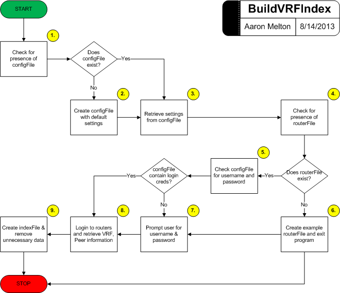

# BuildVRFIndex.py #
----------

## About ##
**BuildVRFIndex.py** is a Python application created from the buildIndex()
function in VRF Search Tool v0.0.10-beta.  I created this stand-alone
application so that an index of VRF names and their locations could be
updated without having to run an application containing this function.
This may be useful if run as a scheduled job.

## Dependencies ##
Exscript module [https://github.com/knipknap/exscript/](https://github.com/knipknap/exscript/)

## Requirements ##
1. This application is hard-coded to use the SSH2 protocol; If SSH v2 is not
   enabled on your router(s), you will need to:
   * Add `ip ssh version 2` to your Cisco router(s) configuration and any 
   associated access-list changes.
   or
   * Alter the `default_protocol` variable in the `get_hosts_from_file` function
   to use a different protocol enabled on your router(s).
2. A valid username/password.
3. Presence of a `routers.txt` file containing a list, one per line, of 
   Hostnames or IP Addresses of routers on which VRF tunnels are configured.
   (If one is not provided, the application will create an example file for
   the user.)
4. Presence of a `settings.cfg` file containing optional configuration settings
   to fully automate or alter the functionality of the application. (If one is 
   not provided, the application will create an example file for the user.)
   Absence of custom settings in the `settings.cfg` file will cause the application
   to run in interactive mode with default settings.
5. If a password is stored in `settings.cfg` it must be base64-encoded.

## Assumptions ##
1. This application was written for use on Cisco IOS devices and cannot be
   guaranteed to work on other makes/model routers.
2. This application assumes that you have enable privileges on each router
   in order to execute the `show running-config` command.  If you do not
   have sufficient user privileges, this application will not work as
   designed.

## Limitations ##
1. This application uses the same username/password to access ALL routers. If
   your routers use unique usernames/passwords, then this script will not work.

## Functionality ##

1. Upon execution, the application will search its parent directory for the 
   presence of a file named `settings.cfg`.
   * If this file exists, the application will proceed to Step 3.
   * If this file does not exist, the application will continue to Step 2.
2. The application will create an example `settings.cfg` file in the parent
   directory and continue to Step 3.
3. The application will open the `settings.cfg` file and retrieve any custom
   settings from the file and continue to Step 4.
4. The application will search its parent directory for the presence of a file
   named `routers.txt`.
   * If this file exists, the application will continue to Step 5.
   * If this file does not exist, the application will proceed to Step 6.
5. The application will check to see if a username and password was specified
   in the `settings.cfg` file.
   * If a username and password was set, the application will proceed to Step 8.
   * If a username and password was not set, the application will continue to Step 7.
6. The application will display instructions for the use of the `routers.txt`
   file.  The application will also create an example file and place it in 
   its parent directory end exit (END).
7. The application will ask the user for their username and password.  These
   credentials will be used to login to each of the routers listed in the 
   `routers.txt` file.  Continue to Step 8.
8. The application will log in to each of the routers listed in the
   `routers.txt` file using the username and password provided by the user or
   obtained from the `settings.cfg` file. 
   Using the `show run | include crypto keyring` command, the application 
   will collect all the VRFs configured on each router and write them to 
   the `index.txt.tmp` file.  Continue to Step 9.
9. Removing all the unnecessary information from the `index.txt.tmp` file,
   the application will copy the VRF Name, Customer Peer IP and Local Peer IP
   (separated by commas) into an `index.txt` file.  The application will then
   remove the temporary file, `index.txt.tmp` and exit (END).
   Note: If the `index.txt` file already exists, it will be overwritten during 
   this step.
